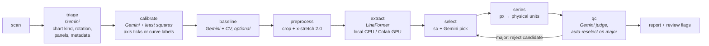

# GraphDigitization

Automated digitization of historical line charts (hydrographs, forestry yield curves, …):
a multimodal LLM does the *semantic* reading that human annotators used to do by hand,
a transformer line-extraction model does the *pixel* work, and plain math turns pixels
into physical units — a fully digitized series with provenance and confidence.

- **Gemini 3.5 Flash**: chart panel detection, axis tick reading + unit detection,
  metadata extraction, zero-line localization, visual quality control, near-tie candidate
  arbitration.
- **[LineFormer](https://github.com/TheJaeLal/LineFormer)** (Lal et al., ICDAR 2023):
  polyline instance segmentation of the drawn curve.
- **Plain Python**: least-squares axis calibration with outlier rejection, warp
  correction, resampling, unit conversion, evaluation metrics.

The pipeline automates the manual steps of the HWLR workflow from Rehbein,
*Reconstructing nineteenth-century Danube river water levels with transformer-based
computer vision* (Earth Syst. Sci. Data 18, 1783–1811, 2026) — its conclusion names
"monthly panel detection and y axis anchor extraction" as the remaining manual
bottlenecks — and generalizes it to arbitrary historical line charts.
Reference data: [Zenodo 17296751](https://zenodo.org/records/17296751) (CC-BY-4.0).



How it works in detail: [`docs/how_it_works.md`](docs/how_it_works.md).

Every stage writes typed JSON artifacts into a run directory (resumable, inspectable,
remotely executable) and everything below a confidence gate lands in `review/flags.json`
for targeted human verification. See `docs/design.md`.

## Quick start

```bash
uv sync
cp .env.example .env                      # add your GEMINI_API_KEY

# generic chart (panel detection + axis calibration fully automated):
uv run graphdig run data/samples/forestry_A382_019.jpeg --profile generic

# Danube reference data:
uv run graphdig fetch-data --small        # annotations, ground truth, series (~25 MB)
uv run graphdig fetch-data --tiles 210018 # monthly tiles via ranged zip reads
uv run graphdig danube-prep 210018 1839 --run   # seeded from the published annotations*
uv run graphdig evaluate series --runs "outputs/runs/*210018*"
```

\* the published monthly tiles carry no axis labels (they live on the unpublished page
margins), so Danube runs take calibration from the dataset's human annotations — exactly
what the paper's production used — while extraction, selection, series building and QC
run automated. Gemini calibration is exercised on charts that carry their labels
(e.g. the bundled forestry samples). See `docs/dataset_layout.md`.

## LineFormer backends

| backend | when | setup |
|---|---|---|
| `lineformer_local` | few pages, no GPU needed | `./scripts/setup_lineformer_env.ps1` (or `.sh`) — isolated py3.10 venv, torch 1.13.1 CPU |
| `colab_bundle` | batch runs on GPU | `graphdig export-job` → `notebooks/lineformer_colab.ipynb` → `graphdig import-results` (see `docs/colab.md`) |
| `stub` | tests / dry runs | none |

Local GPU is deliberately unsupported: LineFormer's pinned CUDA 11.7 stack cannot run on
Blackwell-generation cards. LineFormer publishes no license, so its code is cloned into
gitignored `external/`, never vendored.

## Pilot results (automated, no human in the loop)

36 gauge-months (Neu-Ulm 1839, Vilshofen 1844, Passau 1848), local CPU extraction,
pure s_α selection (no Gemini QC — no API key configured): median peak-aware score
**0.961** vs **0.980** for the paper's human-picked candidates on the same months;
30/36 months ≥ 0.9, and several months beat the human-picked result. The two failure
months are near-tie wrong-line cases that the Gemini visual pick is designed to catch
(it was skipped without a key). Details: `docs/pilot_results.md`.

## Development

```bash
uv run pytest            # offline suite (73 tests): unit math, synthetic-chart pipeline,
                         # ranged-zip server, bundle round trip
uv run pytest -m live    # needs GEMINI_API_KEY: live prompt smoke tests
uv run ruff check .
```

## License

MIT for this repository. LineFormer remains under its authors' terms (no license
published). Zenodo dataset content is CC-BY-4.0 (Rehbein, 2025).
